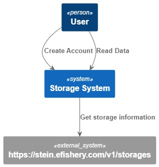
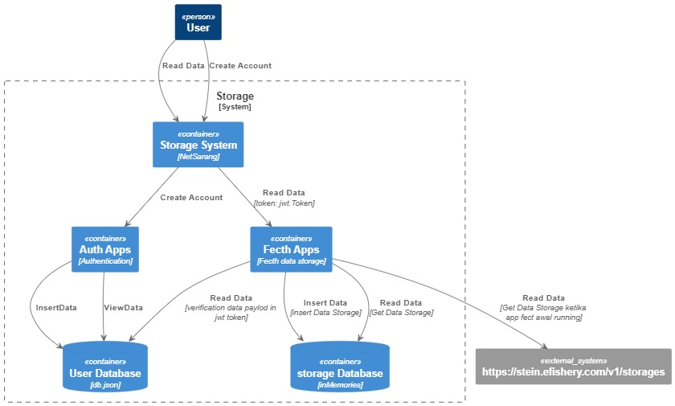
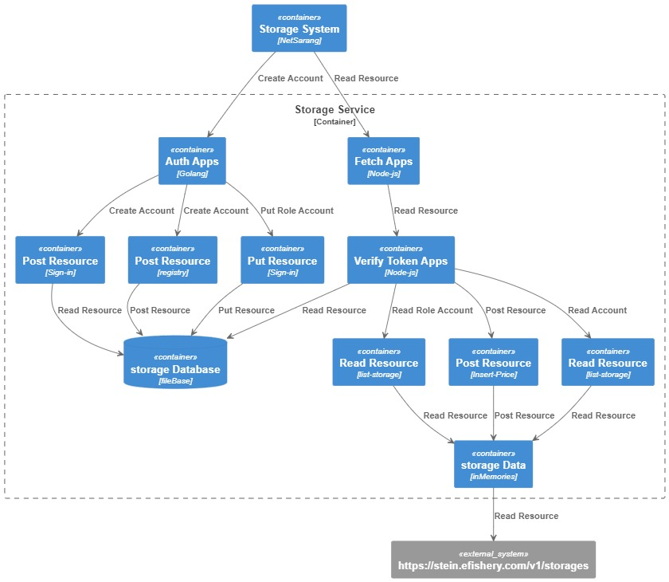
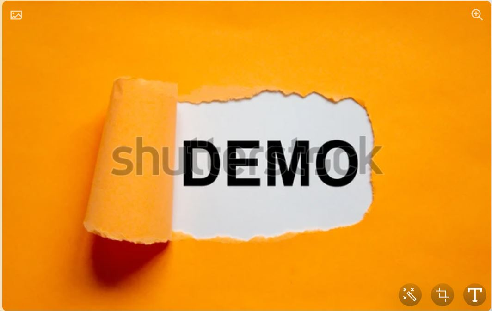

# Efishsery Test

This project is made for recruitment needs.
using 2 programming languages, Auht-app Golang and Fetch-app Node.js

### Installing

installing packing and library in this and how to install them

```
you must open terminal each apps
Node.js :
npm install -save
Golang : 
go mod tidy
....
```

### Installing Extensions

installing packing and library in this and how to install them

```
Docker
PlantUML
....
```

### Installing & Running
Step for setting env and running 

Say what the step will be
- Create ENV file (.env) Auth apps with this configuration:
```
PORT=
SECRETKEY=
DBROUTE=
```
- Create ENV file (.env) Fetch apps with this configuration:
```
PORT=
SECRETKEY=
DATABASE=
```
how to run apps Auth and Fetch:
```
... Auth ...
$ go run .

... Fetch ...
$ npm start
```

### Running the tests

Explain how to run the automated tests for this system
```sh
only available for fetch-app
...
$ npm test
```

### Running coverage 

Explain how to run the tests coverage for this system
```sh
only available for fetch-app
...
$ npm cover
```

### Deployment

Add additional notes about how to deploy this on a live system

### Built With

* [Gorrila] The rest framework used
* [Restify] The rest framework used
* [Npm] - Dependency Management
* [Docker] - Container Management

### Authors

* **RahadiSampurno** - *Initial work* - [Gitlab](https://github.com/rahadisampurno)

#
# Collection Api 

this app used netsarang for server so we can declare host to 116.193.191.33 if you want hit to server but if you test in local, just change url to localhost or 127.0.0.1.

Import url collection in your postman

## Api Collection Url https://www.getpostman.com/collections/41831d5e376a47b706d8

#
# C4 model 
PlantUML must be installed and for Review can press CTRL + P in file.puml (only has )

## Context can be seen in this file  [CONTEXT](context.puml)

## Container can be seen in this file  [CONTAINER](container.puml)

## Component can be seen in this file  [COMPONENT](component.puml)


#
# Vidio Demo
[](https://youtu.be/NRcH34lEWEU)